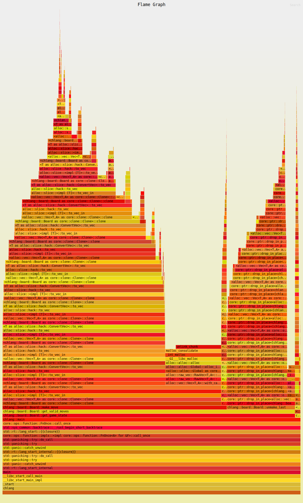

# CHLANG
A Language and bytecode interpreter for chess evaluation functions.

## End goal
The goal is to create a byte-code language where any byte-array above a certain size can be interpreted and run as an evaluation function in a chess engine. This way random chess engine's (may be an overstatement to call them engines) can be created and also genetic algorithms can be used to train engines. A cool thing is that if a random chess engine that is actually good/interesting can be shared by just sharing the bytecode string of the eval-function. (like a "engine id")

I also wan't to create a way to interacte with the engines (web site or terminal app wich can be ssh'd into) and a high-level language that can be translated into the bytecode so that it can easialy be used.

I also wan't to be able to decompile the bytecode into the higher level language again. This will restrict the layout of byte code but it could make for some interesting insights into how engines evaluate positions.

## Tasks
- [X] Chess game
  - [X] board representation
  - [X] move generation
  - [X] finished headless chess game
  - [X] ui
    - [X] terminal
    - [X] gui
- [ ] Chess Engine
  - [X] tree search
  - [X] basic (hardcoded) eval
    - [ ] Evaluators
      - [X] Material Only 
  - [ ] pruning
- [ ] Chlang-language
  - [ ] bytecode interpreter for piece-values, weight's for attacks, positioning of pieces, checks, pins, skewers etc.
  - [ ] possible byte-code feature extensions 
  - [ ] high-level language compiler
  - [ ] decompiler
- [ ] Interface
  - [ ] over ssh
  - [ ] website

## Problem Notebook
### 15/1 
When finishing the headless chess game I noticed it was REALLY slow. I tried out 
using [flamegraph](https://github.com/flamegraph-rs/flamegraph) for cpu profiling, 
something I've seen people on reddit do to analyse performance issues. After running 
it I got this flamegraph

 

Looking at this we can see that most of our time is spent in the make_move method, 
and furthermore most of that time is spent cloning boards. This is probably on [this line](https://github.com/TageDan/Chlang/blob/6b280c7d83fb85c042fa5aa506071c701b65f278/src/board.rs#L122) 
where we save the current boardstate so that we can undo moves and iterate 
through old positions for determining threefold repetition. Making some minor changes as 
to how old boards are stored we can get rid of that clone. And sure enough, by using [hyperfine](https://github.com/sharkdp/hyperfine) 
(a terminal benchmarking tool) on `test_game3` we see that our time goes from an 
average of 456.5 ms ± 14.1 ms to _1.1ms ± 0.2ms_! That's a 450x speedup (if it scales linearly). 
Before, running `test_game` would cuase wsl to crash for me and now it too runs in 1.1ms on average.

